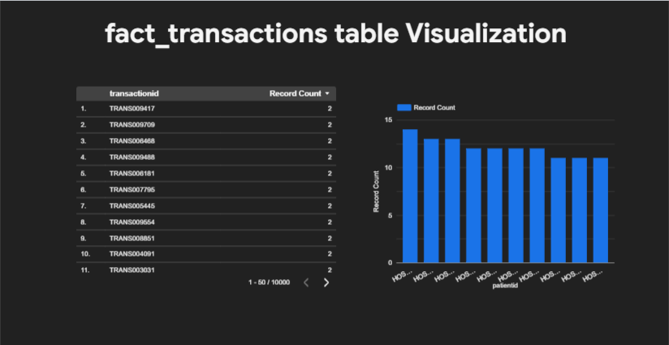
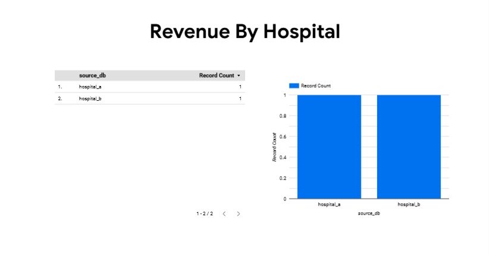
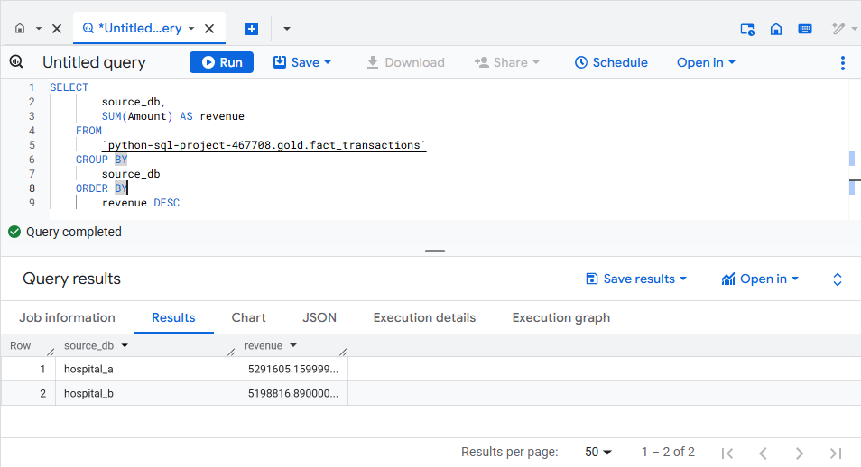
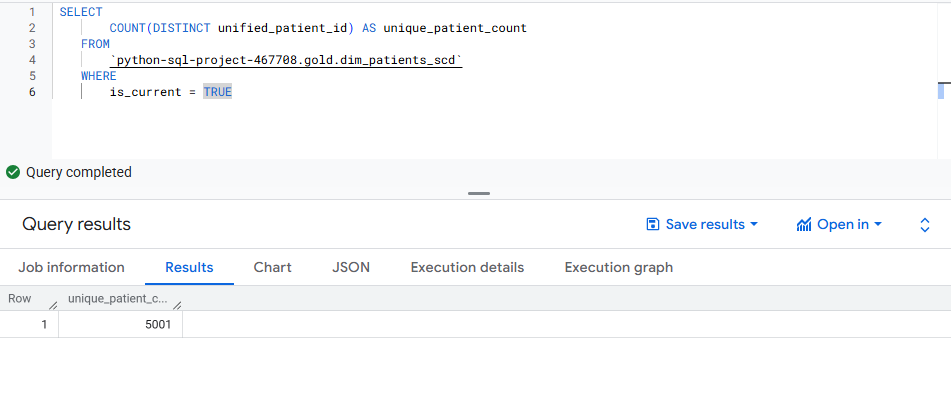
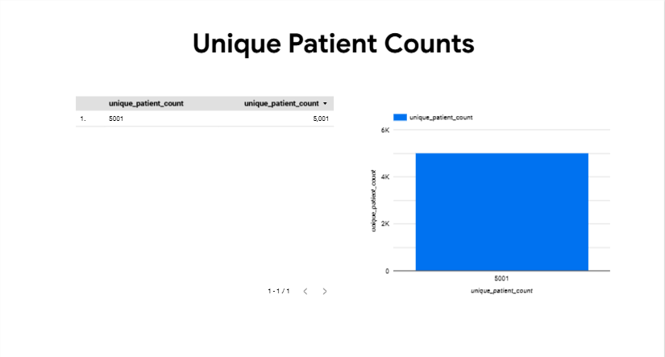

# Healthcare Revenue Cycle Management (RCM) - End-to-End Data Engineering Project

## 🔍 Overview

This project simulates a real-world healthcare analytics pipeline designed to process large-scale patient, claims, and transaction data from multiple hospital systems. It follows best practices in modern data engineering, incorporating a Medallion architecture (Bronze, Silver, Gold), historical data tracking with Slowly Changing Dimensions (SCD Type 2), and a robust BigQuery data warehouse for business intelligence and analytics.

## 🎯 Project Objectives

-   **Consolidate Data:** Ingest data from multiple hospital sources (MySQL, CSV).
-   **Data Quality:** Clean, standardize, and validate all incoming data.
-   **Historical Tracking:** Implement SCD Type 2 for historical patient data tracking.
-   **Data Modeling:** Transform data into a dimensional star schema (facts and dimensions).
-   **Data Warehousing:** Load structured datasets into BigQuery with proper partitioning and clustering.
-   **Metadata Generation:** Generate schema metadata for documentation and auditing.
-   **Analytics:** Support downstream KPIs and Looker Studio dashboards.

## 🛠️ Tech Stack

| Category       | Tools & Technologies                  |
| -------------- | ------------------------------------- |
| **Languages**  | Python, SQL                           |
| **Data Sources**| MySQL, CSV                            |
| **Data Lakehouse**| Google BigQuery                       |
| **Libraries**  | pandas, SQLAlchemy, google-cloud-bigquery |
| **Architecture**| Medallion (Bronze → Silver → Gold)    |
| **Data Modeling**| Dimensional star schema, SCD Type 2   |
| **DevOps**     | Git, GitHub                           |
| **Visualization**| Looker Studio                         |
| **Logging**    | Custom ETL logging via Python logger  |
| **Secrets Mgmt**| python-dotenv (.env)                  |

## 🗂️ Project Structure

```
healthcare_rcm_project/
├───.gitignore
├───main.py
├───README.md
├───requirements.txt
├───.git/
├───assets/
│   ├───fact_transactions_looker.png
│   ├───Revenue_by_hospital_looker.png
│   ├───Revenue_by_Hospital.png
│   ├───Unique_patient_Count.png
│   └───Unique_patient_counts_looker.png
├───config/
│   ├───db_config.py
├───data/
│   ├───raw/
│   │   ├───claims/
│   │   │   ├───hospital1_claim_data.csv
│   │   │   └───hospital2_claim_data.csv
│   │   ├───hospital-a/
│   │   │   ├───ddl.sql
│   │   │   ├───departments.csv
│   │   │   ├───encounters.csv
│   │   │   ├───patients.csv
│   │   │   ├───providers.csv
│   │   │   └───transactions.csv
│   │   ├───hospital-b/
│   │   │   ├───ddl.sql
│   │   │   ├───departments.csv
│   │   │   ├───encounters.csv
│   │   │   ├───patients.csv
│   │   │   ├───providers.csv
│   │   │   └───transactions.csv
│   │   └───reference/
│   │       └───cptcodes.csv
├───docs/
│   └───Healthcare-Revenue-Cycle-Management-sai.pptx
├───src/
│   ├───analytics/
│   │   ├───rcm_analytics.py
│   ├───extract/
│   │   ├───extractor.py
│   ├───load/
│   │   ├───loader.py
│   ├───models/
│   │   ├───dimensional_model.py
│   │   ├───schema_definitions.py
│   ├───transform/
│   │   ├───transformer.py
│   └───utils/
│       ├───generate_schema_summary.py
│       ├───helpers.py
│       ├───logger.py
│       └───update_bigquery.py
```

## ⚙️ Pipeline Flow (Medallion Architecture)

1.  **Bronze Layer:**
    -   Extracts raw data from MySQL databases (`hospital_a`, `hospital_b`) and CSV files (`claims.csv`, `cptcodes.csv`).
    -   Merges data sources and stores them as CSVs in the `data/bronze/` directory.

2.  **Silver Layer:**
    -   Applies data transformation and quality checks:
        -   Gender standardization and email validation.
        -   Date parsing, deduplication, and phone number normalization.
        -   CPT code enrichment through joins.
        -   Handling of missing values with appropriate fallbacks.
    -   Saves the cleaned data as CSVs in the `data/silver/` directory.

3.  **Gold Layer:**
    -   Converts the cleaned data into a star schema:
        -   **Dimension tables:** `dim_patients`, `dim_procedures`, `dim_providers`, `dim_departments`, `dim_date`
        -   **Fact tables:** `fact_transactions`, `fact_claims`
        -   **SCD Type 2:** `dim_patients_scd` for historical patient tracking.
    -   Automatically generates a schema summary (`schema_summary.csv`).
    -   Saves the final datasets in the `data/gold/` directory.

4.  **Load to BigQuery:**
    -   All Silver and Gold layer tables are loaded into Google BigQuery.
    -   Applies partitioning (e.g., by `transaction_date`, `claim_date`) and clustering (e.g., by `unified_patient_id`) for query optimization.
    -   Creates distinct datasets for `bronze`, `silver`, and `gold` layers.

## ✅ Key Features

-   **End-to-End ETL:** A complete pipeline from raw data to a structured data warehouse.
-   **Medallion Architecture:** Follows industry best practices for data lakehouse design.
-   **Robust Transformations:** Includes data validation, standardization, and error handling.
-   **SCD Type 2:** Implements historical tracking for patient dimensions using surrogate keys.
-   **Dimensional Modeling:** Creates a clean star schema for easy analytics and reporting.
-   **BigQuery Integration:** Optimized for performance with partitioning and clustering.
-   **Automated Metadata:** Generates a schema summary for data governance.
-   **Business-Ready Metrics:** Enables calculation of key RCM metrics.

## 📊 Sample KPIs Enabled

| Metric Category | Examples                                           |
| --------------- | -------------------------------------------------- |
| **Revenue**     | Total revenue, monthly revenue trends              |
| **Claims**      | Approval/denial rates, claim volume, processing time |
| **Patients**    | Demographics, insurance coverage, patient volume   |
| **Finance**     | Days in A/R, collection efficiency, write-offs     |
| **Advanced**    | Patient Lifetime Value, Procedure Profitability    |

## 🚀 Getting Started

1.  **Install Dependencies:**
    '''bash
    pip install -r requirements.txt
    '''

2.  **Configure Environment:**
    -   Copy the `.env.example` file to `.env`:
        '''bash
        cp .env.example .env
        '''
    -   Fill in your MySQL and Google Cloud Platform credentials in the `.env` file.

3.  **Run the ETL Pipeline:**
    '''bash
    python main.py
    '''

## 📈 Dashboards & Visualizations

### Fact Transactions Looker


### Revenue by Hospital Looker


### Revenue by Hospital Table


### Unique Patient Count Table


### Unique Patient Counts Looker



## 🔒 Secrets & Environment Management

All credentials (MySQL, GCP) are managed securely using a `.env` file. The `.env.example` file serves as a template.

**Important:** Do not commit the `.env` file to version control.
